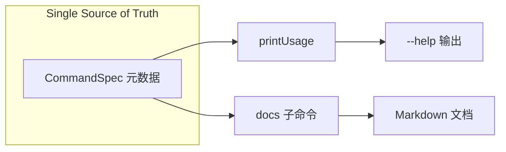

# CLI from-first-src 文档生成实现计划

## 目标

将 homeproxy Go CLI 的 help 与文档统一为单一事实来源：命令元数据定义在代码中，`printUsage` 和 `docs` 子命令都从中渲染，实现 from-first-src 风格的使用文档。

---

## 架构




---

## 实现步骤

### 1. 定义命令元数据结构

在 [cli-go/cmd/homeproxy/main.go](cli-go/cmd/homeproxy/main.go) 或新建 `cli-go/cmd/homeproxy/usage.go` 中定义：

```go
type CmdSpec struct {
    Name     string   // "node"
    Summary  string   // "Node management"
    Actions  []Action // 子动作列表
}

type Action struct {
    Usage string // "list" 或 "add <type> <addr> <port> [label]"
    Desc  string // "List all nodes"
}
```

顶层命令分为两类：

- **有子动作**：node, routing, dns, subscription, control, resources, acl
- **叶命令**：status, log, features, generator, cert, completion（仅 Name + Summary + 可选 Usage）

### 2. 填充命令元数据

将 [main.go](cli-go/cmd/homeproxy/main.go) 中 `printUsage` 的 raw string 抽成 `allCommands []CmdSpec`（或 map），覆盖现有帮助内容，例如：

- node: list, test, set-main, add, remove, edit, import, export
- routing: get, set, set-node, rules, status
- dns: get, set, set-china, test, cache, strategy, status
- subscription: list, add, remove, update, auto-update, filter, status
- control: start, stop, restart, status
- log, features, resources, acl, cert, generator, completion（各自用法）

保持与现有 `--help` 输出语义一致。

### 3. 重构 printUsage

将 `printUsage()` 改为遍历 `allCommands` 生成帮助文本，格式与当前一致：

```
HomeProxy CLI - Command line interface for HomeProxy

Usage: homeproxy <command> [options]

Commands:
    node <action>        Node management
        list                List all nodes
        ...
```

### 4. 新增 docs 子命令

在 `main.go` 的 switch 中增加 `case "docs"`，调用 `docsCommand(subArgs)`。

`docsCommand` 行为：

- 读取 `allCommands` 生成 Markdown
- 支持 `homeproxy docs`（输出到 stdout）或 `homeproxy docs --out ./docs/cli.md`（写入文件）
- 输出结构：标题、Usage、各命令表格（Command | Usage | Description）

可选：支持 `--format markdown`（默认）为后续扩展预留。

### 5. 集成与验证

- 运行 `homeproxy --help` 确保输出与重构前一致
- 运行 `homeproxy docs` 验证 Markdown 生成
- 将 `homeproxy docs --out docs/CLI_REFERENCE.md` 纳入 README 或 Makefile，说明如何刷新文档

---

## 文件变更


| 文件                                                         | 操作                                         |
| ------------------------------------------------------------ | -------------------------------------------- |
| [cli-go/cmd/homeproxy/main.go](cli-go/cmd/homeproxy/main.go) | 抽取元数据、重构 printUsage、新增 docs case  |
| cli-go/cmd/homeproxy/usage.go                                | 新建：CmdSpec/Action 定义与 allCommands 数据 |
| cli-go/cmd/homeproxy/docs.go                                 | 新建：docsCommand 实现                       |
| [cli-go/README.md](cli-go/README.md)                         | 可选：补充 `homeproxy docs` 说明             |


---

## 不变更

- 各子命令内部的 `fmt.Errorf("usage: ...")` 保留，用于错误提示
- 不迁移到 Cobra
- 不改变命令执行逻辑

